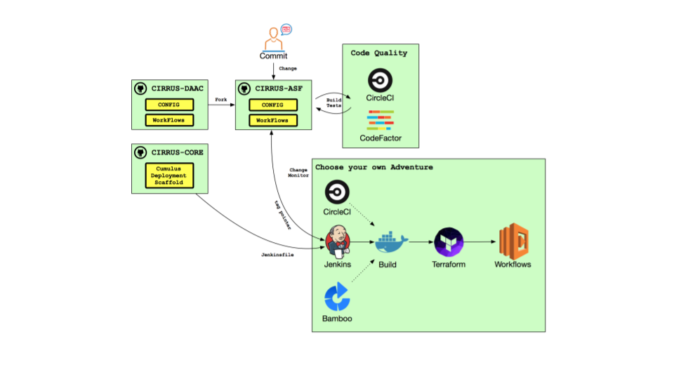

# CIRRUS Core

## Overview

This repository contains the configuration and deployment scripts to
deploy Cumulus Core for a DAAC. All parts of the deployment have been
Terraformed and the configuration minimized by using outputs from
other modules and lookups using Terraform AWS provider data sources.

The project contains a Makefile and CI/CD configuration for Jenkins,
CircleCI, and Bamboo. By configuring a job for one of those CI/CD
providers, CIRRUS core can deploy a DAAC-specific Cumulus
configuration that has been derived from
[CIRRUS-DAAC](https://github.com/asfadmin/CIRRUS-DAAC).

## CIRRUS In Action

See the [Cumulus
Documentation](https://nasa.github.io/cumulus/docs/deployment/deployment-readme)
for detailed information about configuring, deploying, and running
Cumulus.

## Prerequisites

* [Terraform](https://www.terraform.io/)
* [AWS CLI](https://aws.amazon.com/cli/)
* [GNU Make v4.x](https://www.gnu.org/software/make/)
* One or more NGAP accounts (sandbox, SIT, ...)
* AWS credentials for the account(s)

## Organization

The repository is organized into four Terraform modules:

* `tf`: Creates resources for managing Terraform state
* `daac`: Creates DAAC-specific resources necessary for running Cumulus
* `data-persistence`: Creates DynamoDB tables and Elasticsearch
  resources necessary for running Cumulus
* `cumulus`: Creates all runtime Cumulus resources that can then be used
  to run ingest workflows.

To customize the deployment for your DAAC, you will need to update
variables and settings in a few of the modules. Specifically:

### tf module

Configuration of Terraform remote state resources.

### data-persistence module

Configuration of the Cumulus `data-persistence` module.

### cumulus module

Configuration of the Cumulus `cumulus` module.

## Deploying Cumulus

*Important Note*: When choosing values for MATURITY and DEPLOY_NAME:
* The combined length cannot exceed 12 characters
* Must consist of `a-z` (lower case characters), `0-9`, and `-` (hyphen) only

### Local Development (Commandline)

1. Setup your environment with the AWS profile that has permissions to
   deploy to the target NGAP account:

        $ source env.sh <profile-name> <deploy-name> <maturity>

        e.g., to deploy to the XYZ DAAC's NGAP sandbox account with the initials
        of a developer (to make deployment unique) with maturity of 'dev':

        $ source env.sh xyz-sandbox-cumulus kb dev

        (This assumes we've setup AWS credentials with the name `xyz-sandbox-cumulus`)

2. Create `secrets/*.tfvars` (OPTIONAL): These files contains
  *secrets* which are specific to the 'maturity' or environment to
  which you are deploying. Create one file for each environment and
  populate it with secrets. For example, your `dev`
  `urs_client_password` is likely (hopefully!) different than your
  `prod` password.

*Note*: This is only for commandline deployment from a developer
workstation, for example. Normally these secrets would be provided by
the CI/CD provider. See details below on how to do this for Jenkins,
CircleCI, and Bamboo.

*Important Note*: The secrets files will *not* (and *should not*) be
committed to git. The `.gitignore` file will ignore them by default.

3. Link to the DAAC repo to deploy. You're likely doing development on
   a CIRRUS-DAAC-forked repo, so link CIRRUS-core to that repo where
   you're doing active development.

        $ make link-daac \
            DAAC_REPO=$HOME/projects/my-daac-repo

4. Deploy Cumulus. If this is your first Cumulus deployment for this
   stack, deploy the entire Cumulus stack:

        $ make all

5. Deploy Workflows. If you're adding a new workflow, Lambdas, or
   other resources for your workflow, and the rest of the Cumulus
   deployment hasn't changed, just deploy the workflows:

        $ make workflows

### CI/CD: Jenkins Job

TODO

### CI/CD: CircleCI

TODO

### CI/CD: Bamboo

TODO
